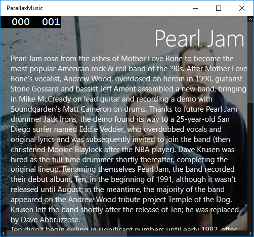
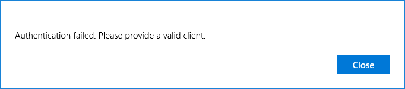

# Parallax and Expression Animation Demo
The following code example is meant to demonstrate the usage of `Windows.UI.Composition` and `Windows.UI.Xaml` APIs to create a fun and engaging UI experience making use various parallax effects. The main APIs and concepts demonstrated are:
- `Windows.UI.Compositon` and `Windows.UI.Xaml` interop
- ScrollViewerManipulationPropertySets
- Keyframe & Expression Animations



## Prerequisites
- [Visual Studio 2015](https://www.visualstudio.com)
- [November 30th, 2015 Windows SDK](https://dev.windows.com/en-us/downloads)
- [Microsoft Groove API](https://music.microsoft.com/developer)

### Microsoft Groove API
This code example leverages a remote data source which is powered by the [Microsoft Groove API](https://music.microsoft.com/developer).

In order to execute this code example, you must obtain an [API Key](https://datamarket.azure.com/dataset/xboxmusic/XboxMusicPlatform) to be used to authenticate with API to retrieve data.

Once you have an API Key, update the following lines in the `Data/RemoteDataSource.cs` file with your specific information:

```csharp
private static readonly string CLIENT_ID = "[CLIENT_ID]";
private static readonly string CLIENT_SECRET = "[CLIENT_SECRET]";
```

You can find more documentation and information Microsoft Groove API on MSDN: [Groove Service](https://msdn.microsoft.com/en-us/library/dn546696.aspx)

## Running the Example
Build and Deploy the code example using [Visual Studio 2015](https://www.visualstudio.com) 

## Common Errors
If you see the following dialog then it is assumed that a valid client id and client secret was not provided for authentication:

        